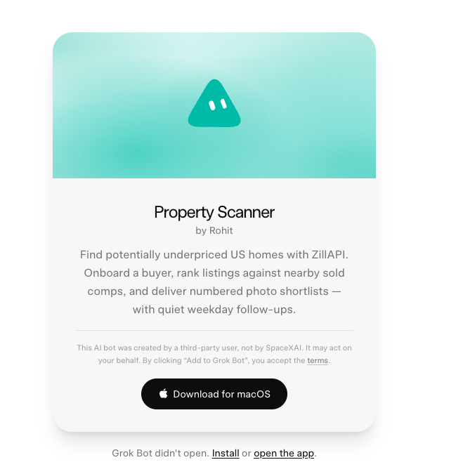

# Property Scanner

**An AI real estate skill that finds homes worth a closer look.**

Search US homes with [ZillAPI MCP](https://zillapi.com/ai-agents/), compare prices, and get a ranked photo shortlist. Tell your agent what you like. Let it remember your preferences and repeat the search on your schedule.

### Copy this into your agent

```text
Install this skill and onboard me:
https://github.com/therohitdas/property-scanner
```

**[Add the Grok Bot →](https://x.ai/bot/-4Hs8iXe_p6Cfc1IRbilu)** · [Install with npx](#install-with-npx) · [How it finds opportunities](#how-it-finds-opportunities)

## Start with your search

> Austin, under $475k, at least 3 bedrooms. I'd prefer a home without a pool.

The agent walks you through connecting ZillAPI with **OAuth**, saves your search, and gets to work. Its shortlist gives you:

- **A photo and the basics:** address, asking price, bedrooms, bathrooms, and size.
- **A reason to look:** the price gap, supporting comparisons, and relevant price cuts.
- **The evidence behind the number:** how many comparisons were used, whether prices are actual sales or pending asking prices, and what needs review.
- **An easy next step:** reply with a home's number to see its comparisons and listing details.

“Exclude fixer-uppers” changes future searches. “Run this every weekday morning” sets up a routine in an agent with scheduling support. Recurring updates focus on new matches and meaningful changes.

## Use the Grok Bot template

Prefer a ready-made bot? Open **[Property Scanner in Grok Bot](https://x.ai/bot/-4Hs8iXe_p6Cfc1IRbilu)** and follow its onboarding.

<p align="center">
  <a href="https://x.ai/bot/-4Hs8iXe_p6Cfc1IRbilu">
    
  </a>
</p>

The template runs in Grok Bot. This repository contains the original portable skill for other compatible agents.

## Install with npx

With Node.js installed, run:

```bash
npx skills add therohitdas/property-scanner --skill property-scanner
```

Choose your agent in the installer, then ask it:

```text
Use Property Scanner and onboard me.
```

The [Skills CLI](https://github.com/vercel-labs/skills) installs the skill, references, and calculation helper together. Your agent needs **Agent Skills support and access to ZillAPI MCP**. Persistent memory enables saved preferences; a scheduler enables routines. The included helper uses Python 3 and its standard library; the skill also specifies the calculations for hosts with another execution tool.

For a manual installation, copy the entire [`skills/property-scanner`](skills/property-scanner) directory into your agent's skill location. Keep its `references` and `scripts` folders with `SKILL.md`.

## How it finds opportunities

Property Scanner compares an asking price with nearby property evidence and Zestimate. It starts in **relaxed mode** to surface leads for review; **strict mode** requires stronger comparison coverage.

| | Relaxed · default | Strict · optional |
| --- | --- | --- |
| Minimum price gap | 3% | 5% |
| Comparison homes | At least 1; prefer 2+ | At least 3 |
| Search radius around a home | 2.5 miles | 1 mile |
| Missing Zestimate | Use comparison reference; flag for review | Cannot assess |
| Missing closed sale price | May use a recent pending asking price; flag for review | Exclude that comparison |

The calculation uses median comparison price per square foot × the home's size. When Zestimate is present, the **lower reference** determines the gap. Actual sales take precedence over asking-price substitutes for the same sale episode. Any substitute is labeled; a mixed set is never presented as pure sold-price evidence.

The bot also checks similarity, listing concerns, and your preferences. A price cut alone does not qualify a home. See the [full comparison and ranking rules](skills/property-scanner/references/scanning.md).

**These are leads to investigate, not appraisals or guaranteed bargains.** One comparison, asking-price substitutes, missing estimates, and substantial property differences can weaken the signal. The bot keeps that context visible.

## A scan budget you can control

ZillAPI charges per returned record. The skill limits fetching and reuses saved comparisons:

| Work | Default credit ceiling, including lookups |
| --- | --- |
| Active scan · up to 10 listings | 20 |
| Comparison refresh · up to 20 listings, initially and at most weekly | 40 |
| Initial scan and comparison setup | 60 |
| All scanner activity per billing period | 900 |

These are instructed budgets, not measured usage guarantees or a limit enforced by ZillAPI. The agent tracks usage and stops before exceeding them. Manual scans and follow-ups share the allowance. Smaller searches provide focused coverage; they do not inspect every home in a city.

You need your own ZillAPI account and sufficient credits. OAuth is preferred; API keys are a fallback. Check [current ZillAPI pricing](https://zillapi.com/pricing/) and the [fetching and budget rules](skills/property-scanner/references/zillapi.md).

## Inside the skill

The entry point stays short. The agent loads details for its current task:

| File | Job |
| --- | --- |
| [SKILL.md](skills/property-scanner/SKILL.md) | Core behavior and routing |
| [Onboarding](skills/property-scanner/references/onboarding.md) | Connect, establish preferences, and run once |
| [ZillAPI](skills/property-scanner/references/zillapi.md) | Data fetching, OAuth, and credit limits |
| [Scanning](skills/property-scanner/references/scanning.md) | Matching, formulas, and ranking |
| [Delivery](skills/property-scanner/references/delivery.md) | Photo messages and numbered follow-ups |
| [Preferences and routines](skills/property-scanner/references/preferences-and-routines.md) | Learn from feedback and repeat the search |

The [calculation helper](skills/property-scanner/scripts/rank_properties.py) works on normalized, prefiltered records. It makes no network calls. Property retrieval, semantic matching, authorization, messaging, and scheduling are handled by the host agent.

To run the calculation tests:

```bash
python3 -m unittest discover -s tests -v
```

Found a bug or have a useful improvement? [Open an issue](https://github.com/therohitdas/property-scanner/issues). Use an anonymized example without credentials or personal search history.

---

Built by [Rohit Das](https://therohitdas.com) with [ZillAPI](https://zillapi.com). [MIT licensed](LICENSE).

ZillAPI is an independent service, not affiliated with Zillow Group. Zillow and Zestimate are trademarks of Zillow Group. The Grok Bot template is user-created; this repository is not an official xAI product.
